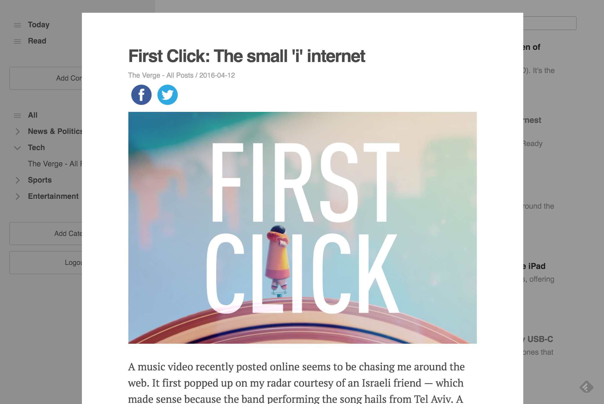

# NewsJunkie

[NewsJunkie](http://www.newsjunkie.in) is a clone of [Feedly](http://www.feedly.com), the RSS feed reader that allows its users to curate their own newsfeeds. It is built with [Ruby on Rails](http://rubyonrails.org/) and [React.js](https://facebook.github.io/react/). Visit the [live webiste here](http://www.newsjunkie.in)!

### Features

* Users can subscribe and unsubscribe to RSS feeds and organize them into categories
* Categories can be rearranged, renamed, and deleted
* RSS feeds are housed in a centralized database in order to speed up load time for users and to track feed popularity
* Articles imported from RSS feeds are sanitized, stripped of ads, and cached in a centralized database
* Users can share articles on social media
* Thumbnail images for articles are cached and saved on [AWS](https://aws.amazon.com/)
* Users can search for articles using [pgSearch](https://github.com/Casecommons/pg_search)
* Users can mark articles as read and browse their reading history
* Users can create their own accounts or login with [Facebook](https://en.wikipedia.org/wiki/OAuth)

### Screenshots

**Main View**

**Article View**

