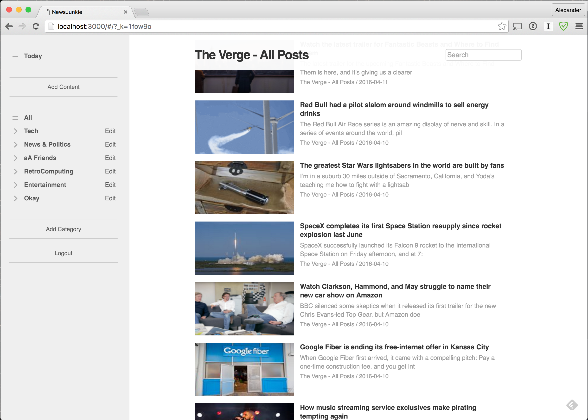
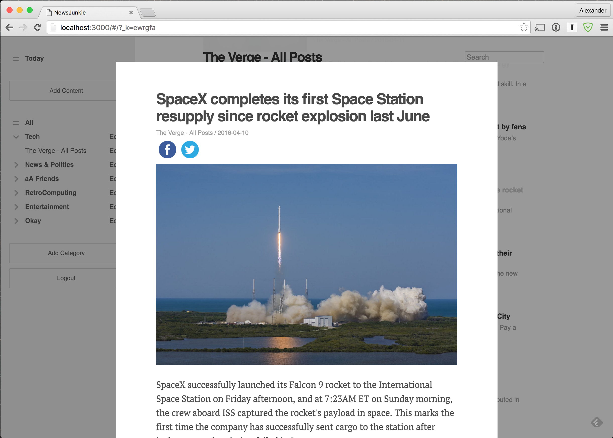

# NewsJunkie

[http:/www.newsjunkie.in/](http:/www.newsjunkie.in/)

## Minimum Viable Product

NewsJunkie is a web application inspired by Feedly built using Ruby on Rails
and React.js. NewsJunkie allows users to:

- [X] Create an account / Login with Facebook
- [X] Log in / Log out
- [X] Subscribe to, read, and delete RSS feeds
- [X] Organize feeds within categories
- [X] View feeds in list style
- [X] View articles
- [X] Share articles on social media
- [ ] Mark articles as read

## Design Docs
* [View Wireframes][views]
* [React Components][components]
* [DB schema][schema]

[views]: ./docs/wireframes
[components]: ./docs/components.md
[schema]: ./docs/schema.md

## Implementation Timeline

### Phase 1: Backend setup and User Authentication (1 day)

**Objective:** Functioning rails project with Authentication

- [X] create new project
- [X] create `User` model
- [X] authentication
- [X] user signup/signin pages
- [X] blank landing page after signin
- [X] build signin/up views

### Phase 2: Categories Model (1.5 days)

**Objective:** Users can create and delete categories through
the API and UI.

- [X] create `Categories` model
- [X] CRUD API for categories
- [X] jBuilder views for categories
- [X] setup Webpack & Flux scaffold
- [X] setup `APIUtil` to interact with the API
- [X] test out API interaction in the console.
- [X] build categories views
  - [X] `Sidebar`
    - [X] `CategoriesContainer`
    - [X] `Category`
- [X] style categories views

### Phase 3: Feeds Model (1.5 days)

**Objective:** Users can subscribe and unsubscribe to RSS feeds through
the API and UI.

- [X] create `Feeds` model (`Categories` have many `Feeds`)
- [X] save feeds to the DB on submit.
- [X] CRUD API for feeds
- [X] jBuilder views for feeds
- [X] test API interaction in the console
- [X] build feeds views
  - [X] `Sidebar`
    - [X] `Category`
      - [X] `Feed`
  - [X] `Main`
    - [X] `Header`

### Phase 4: Articles Model (1.5 days)

**Objective:** Users can mark view and mark articles as read from the API and UI.

- [X] create `Articles` model (`Feeds` have many `Articles`)
- [X] CRUD API for articles
- [X] jBuilder views for articles
- [X] test API interaction in the console
- [X] build article views
  - [X] `Main`
    - [X] `ArticleItem`
    - [X] `ArticleView`

### Phase 5: Develop Controls (1 day)

**Objective:** users can refresh, mark all as read, and share articles.

- [ ] CRUD API for refresh and mark all as read
- [X] CRUD API for sharing on social media
- [ ] build components

### Bonus

- [X] Add welcome page that suggests starter feeds for new users based on indicated interests
